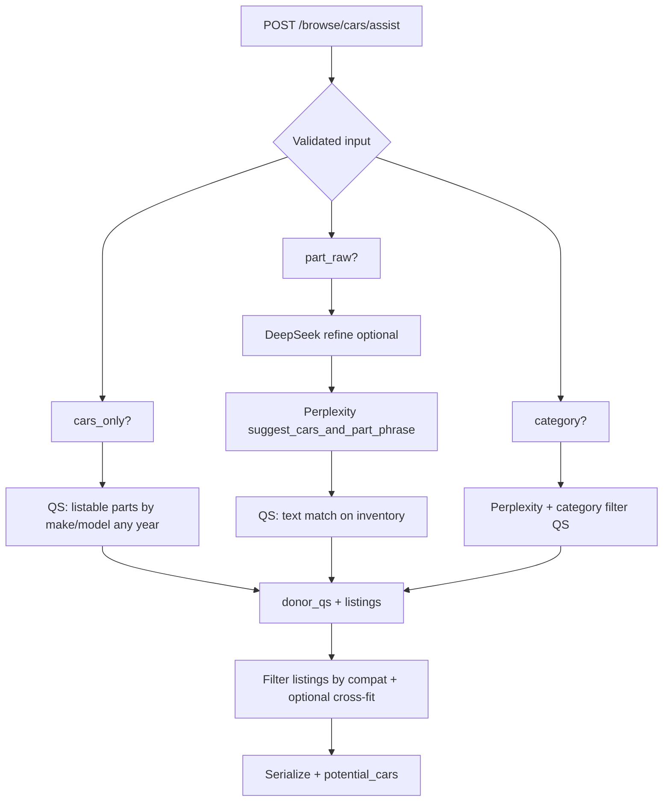

# How Partbridge Works

This document covers (1) the **user journey from the first page to downstream pages**, and (2) **how backend logic** ties those screens together. For the long-term roadmap, see `steps` in the repo root.

**API base:** `NEXT_PUBLIC_API_URL` → typically `http://127.0.0.1:8000/api/v1`  
**Auth:** JWT in `localStorage` (`lmp_access`, `lmp_refresh`); `GET /auth/me` hydrates `user` (including `role`: `buyer` | `seller` | `both`).

---

## Part A — Frontend journey: start page to end pages

The **global navbar** (`frontend/src/components/Navbar.jsx`) appears on every route **except** `/` (the marketing home builds its own header). It is **role-aware**: sellers see inventory/orders/money/dashboard; buyers see purchases/cart; `both` sees the combined set.

Below is a typical path from **landing** through **purchase or seller ops**. Not every user hits every page.

### A.1 Landing page — `/`

- **File:** `frontend/src/app/page.jsx`
- **Navbar:** hidden (`Navbar` returns `null` when `pathname === "/"`).
- **Purpose:** Marketing hero, value props, links into the product.
- **Typical next steps:**
  - **Browse** → `/browse` (anonymous allowed).
  - **Sign in** → `/login`, **Register** → `/register`.
  - Logged-in users may jump to **Dashboard**, **My vehicles**, etc. from in-page CTAs (home still uses its own buttons in addition to navbar on other routes).

### A.2 Account creation & sign-in

| Page | Path | What happens |
|------|------|----------------|
| Register | `/register` | `POST /auth/register` → tokens + user; may require email verification. |
| Login | `/login` | `POST /auth/login` → JWT stored; redirect often uses `?next=` (e.g. back to `/browse`). |
| Verify email | `/verify-email` | Confirms token from email; hits verify endpoint. |
| Forgot / reset password | `/forgot-password`, `/reset-password` | Password reset flow via accounts API. |

After login, **`AuthProvider`** (`src/context/auth-context.jsx`) keeps the session and **`GET /auth/me`** drives navbar links (`user.role`).

### A.3 Buyer discovery — `/browse`

- **File:** `frontend/src/app/browse/page.jsx`
- **Anonymous:** search and view results; messaging redirects to login.
- **Flow:**
  1. User sets **year, make, model** (from `cars-data`), optional **part** (`parts-data` + free text + optional `POST /browse/normalize-part/`), **ZIP**.
  2. **Search** → `POST /browse/cars/assist/` with body including `compatible_vehicles` if the client cached prior AI suggestions.
  3. Response → `listings` (part rows), `potential_cars` (donor vehicles), `ai_vehicle_suggestions`, `normalized_part_query`, etc. Results can be cached in `sessionStorage`.
  4. UI groups listings by vehicle, supports **filters/sort**, **pagination**, **select vehicles** + **Message sellers** (bulk → `POST /messages/bulk-rfq/`) or per-card **Message** (`POST /messages/start/`).
  5. Optional: **reverse ZIP** via `GET /browse/reverse-zip/` or client geocode.

**End of this stage:** user opens a donor **vehicle detail** or sends messages / goes to cart.

### A.4 Public donor vehicle — `/browse/vehicles/[id]`

- **File:** `frontend/src/app/browse/vehicles/[id]/page.jsx`
- **Load:** `GET /browse/vehicles/<id>/?buyer_zip=...` (ZIP from saved browse prefs in `localStorage`).
- **Shows:** photos, specs, seller summary, **Buy Now** parts (`BrowsePartCard`), message block with **PartsPickerMulti**, optional **similar vehicles** from another `POST /browse/cars/assist/` (cars-only style query).
- **Buy Now modal:** shipping options as radios; **Buy Now** → `/checkout?part=<id>&shipping=<mode>`.

### A.5 Seller inventory (authenticated)

| Page | Path | What happens |
|------|------|----------------|
| Vehicle list | `/vehicles` | `GET /vehicles/` — seller’s vehicles. |
| Add vehicle | `/vehicles/new` | Create vehicle (VIN decode, etc.), then seed parts. |
| Vehicle dashboard | `/vehicles/[id]` | `GET/PATCH /vehicles/<id>/`, parts `GET /vehicles/<id>/parts/`, photos, damage, analytics status. |

This is the **seller** source of truth for what appears in public browse (through `public_listable_*` rules on the backend).

### A.6 Cart & checkout (buyer)

| Page | Path | What happens |
|------|------|----------------|
| Cart | `/cart` | `GET/POST /cart/`, line items with shipping modes; checkout stub may call `POST /cart/checkout/`. |
| Checkout | `/checkout` | Requires login; reads `?part=` and `?shipping=`; `POST /orders/checkout-intent/` with fitment/policy checkboxes; optional simulate payment. |

**End state:** order created (MVP stubs) → user can track under **Orders**.

### A.7 Messaging — `/inbox`

- **File:** `frontend/src/app/inbox/page.jsx`
- **Load:** `GET /messages/threads/`; selecting a thread → `GET /messages/threads/<id>/`, send → `POST` messages endpoints, quotes as implemented.
- Threads are anchored to a **vehicle part** (seller context).

### A.8 Orders & seller money

| Page | Path | Role | What happens |
|------|------|------|----------------|
| Orders | `/orders` | Buyer + seller | `GET /orders/`; seller may see action queue `GET /orders/seller/action-queue/` and confirm/ship flows. |
| Money | `/money` | Seller | `GET /orders/money/summary/`, verification `POST /orders/seller-verification/`, cashout `POST /orders/money/cashout/`. |

### A.9 Account hub — `/dashboard`

- **File:** `frontend/src/app/dashboard/page.jsx`
- **Shows:** profile fields from `user` (from `/auth/me`), sign out.
- **Navigation:** deeper links are in the **navbar** (not duplicated as a second nav strip on this page).

---

### Journey summary (linear)

```
/ (marketing)
  → /register | /login
  → /browse → /browse/vehicles/[id]
  → (login) /messages/start | /messages/bulk-rfq → /inbox
  → /cart → /checkout → /orders

Seller parallel:
  → /vehicles → /vehicles/new → /vehicles/[id]
  → /orders (seller actions) → /money
```

---

## Part B — Backend logic

All JSON APIs live under **`/api/v1/`** (see `backend/config/urls.py`). Apps are included in order: **accounts**, **vehicles**, **messaging**, **orders**, **analytics**.

### B.1 Authentication

- **Register / login** issue JWT pair; **refresh** at `/auth/token/refresh`.
- **Me:** `GET /auth/me` → `UserSerializer` (id, email, name, phone, **role**, email verified, date_joined).
- Protected views use **IsAuthenticated** + ownership checks on vehicles/parts/orders as implemented per view.

### B.2 Vehicles: public vs seller

**Seller** uses **`VehicleViewSet`** (`/vehicles/...`) with permissions **owner-only** for mutations.

**Public browse** never exposes PII; it uses:

- **`public_listable_vehicle_parts_queryset()`** — `VehiclePart` rows that are listable (not removed, not `buy_new_only` family, vehicle has year/make/model, listing state in draft / message_only / buy_now per product rules).
- **`PublicVehiclePartSerializer`** — adds `vehicle_public` (masked location), `shipping_preview` (stub), `listing_state_effective`, etc.

### B.3 `POST /browse/cars/assist/` — core algorithm

**Entry:** `PublicCarAssistView` in `backend/vehicles/views.py`.  
**Input validation:** `PublicCarAssistInputSerializer` — requires either **(make + model)** without part for “cars only”, or **part** or **category**, and never category + free-text part together.

**Branches:**

1. **`cars_only`** — user selected make+model, no part and no category:  
   `qs = public_listable_parts_for_buyer_vehicle(vd, match_year=False)`  
   → all listable parts for that make/model **any year**.

2. **`part_raw` (custom part text):**
   - **`deepseek_refine_part_phrase`** (optional) → `refined_for_search`.
   - **`suggest_cars_and_part_phrase`** (`ai_assist.py`): **Perplexity** returns `normalized_part_query` + **`candidate_vehicles`** (make/model/year ranges). If no API key, **`_fallback_vehicle_suggestions`** uses a heuristic window around buyer year.
   - **Text query on inventory:** `_part_search_term_q` — full phrases plus **word tokens (≥3 chars)** against label, description, part family name.
   - **`qs`** = public listable parts matching those terms.

3. **Category** (no free-text part): filter by `part_family__category__slug`, same AI assist for normalized phrasing and candidates.

**Donor vehicles (`donor_qs`):**

- Start from **`public_listable_parts_for_buyer_vehicle(vd, match_year=True)`** (buyer year ± slack, make, model).
- **OR** expand with **`_compat_candidates_vehicle_q(all_candidates)`** where `all_candidates` = Perplexity candidates + client **`compatible_vehicles`** replay.

**Listings (what the buyer sees as part rows):**

- If **cars_only** or no buyer Y/M/M: `listings_qs = qs`.
- Else:
  - `compat_ids` = vehicle IDs appearing in `donor_qs`.
  - Detect **`qs_has_buy_now`** on the text-matched `qs`.
  - **If** custom part + candidates + **no** Buy Now hits: restrict to `qs` on `compat_ids` only (strict compatible set); skip cross-fit extras.
  - **Else if** candidate Q exists: union `vehicle_id ∈ compat_ids` with parts matching **Perplexity vehicle OR**.
  - **Else:** union `compat_ids` with **`_buyer_make_model_ignore_year_q`** (same make/model, year not required).
  - Union **`buy_now_cross_fit_parts`** where applicable (Buy Now on non-primary donor with description fitment + name tokens).
- **Annotate** priority: Buy Now + price first, then `-updated_at`.
- **Slice** to a capped list (e.g. 48) and serialize with buyer ZIP in context for shipping preview.

**Potential cars:** `_build_potential_donor_payloads(donor_qs, ...)` — aggregated donor cards for the UI “more vehicles” section.

**Response JSON:** `listings`, `listings_count`, `potential_cars`, `ai_vehicle_suggestions`, `normalized_part_query`, `part_refinement`, `search_mode`, etc.

### B.4 `GET /browse/vehicles/<id>/`

- Loads one **Vehicle** if **`public_listable_vehicle_parts_queryset()`** has at least one part for that id (otherwise 404).
- Returns vehicle payload + serialized parts + inactive/sold summary as implemented in `PublicBrowseVehicleDetailView`.

### B.5 Messaging

- **`Thread`** links **buyer**, **seller**, **`vehicle_part`**.
- **`POST /messages/start/`** — `StartThreadSerializer`: `vehicle_part_id`, optional `message`; creates/get thread, optional first `Message`.
- **`POST /messages/bulk-rfq/`** — many `vehicle_part_ids`, one `message`; skips invalid/self-listings.
- **List/detail/message/quote** endpoints under `messages/threads/...` (see `messaging/urls.py`).

### B.6 Orders & cart

- **Cart:** `CartView`, line items with `vehicle_part_id`, shipping mode, buyer ZIP snapshot.
- **Checkout intent:** `CheckoutIntentView` — Stripe PaymentIntent (or stub), fitment/policy flags, pickup/next-day flags derived from shipping mode.
- **Orders list:** `OrderListView` — buyer sees purchases; seller sees sales (same endpoint, filtered by backend logic).
- **Money / verification / seller actions:** paths in `orders/urls.py` (summary, cashout, seller confirm, shipping plan, etc.).

### B.7 Analytics

- Separate **`/api/v1/analytics/`** app: vehicle market jobs, scrapers — triggered from vehicle lifecycle; not required for basic browse/checkout paths.

---

## Diagram: browse assist (conceptual)



---

## Configuration

See **`backend/config/settings.py`** for: `DEEPSEEK_API_KEY`, `PERPLEXITY_API_KEY`, Stripe, database, Celery, email.

---

## Related files

| Area | Path |
|------|------|
| All `views.py` endpoints (reference) | `docs/VIEWS.md` |
| Assist view & helpers | `backend/vehicles/views.py` |
| AI suggest / fallback | `backend/vehicles/ai_assist.py` |
| Shipping preview stub | `backend/vehicles/shipping_preview.py` |
| Public serializers | `backend/vehicles/serializers.py` |
| URL routes | `backend/*/urls.py` |
| Browse UI | `frontend/src/app/browse/page.jsx` |
| API client | `frontend/src/lib/api.js` |
| Navbar | `frontend/src/components/Navbar.jsx` |

This document should be updated when routes or assist rules change.
